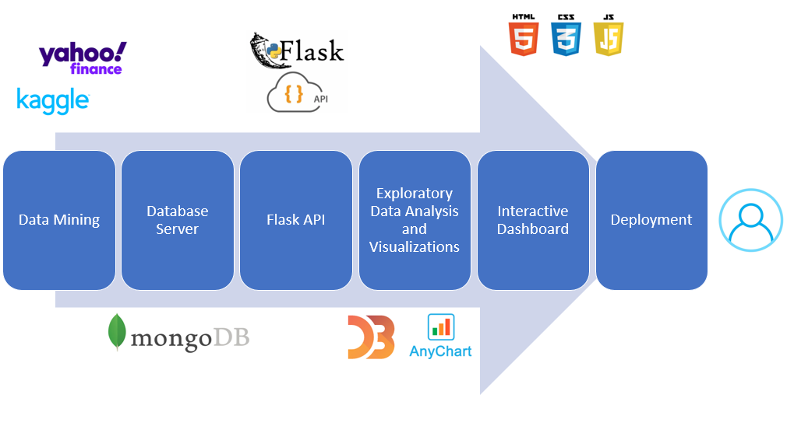

# Cryptocurrency vs Market Interactive Dashboard

## Deployment Link

The dashboard is deployed in AWS. To access the page, click the following link to explore the cryptocurrency vs market dashboard.

* http://cryptocurrencyproject.us-east-2.elasticbeanstalk.com/

## Background 

A cryptocurrency is a digital currency in which encryption techniques are used to regulate the generation of units of currency and verify the transfer of funds, operating independently of a central bank.

Why is Crypto so important and should I care?
* The cryptocurrency markets are currently all over the place. There are a number of high-quality digital token and coin issuers, with excellent backers and management, with very good AML procedures in place, a great business model, etc. 
* Some economic analysts predict a big change in crypto is forthcoming as institutional money enters the market.
* Moreover, there is the possibility that crypto will be floated on the Nasdaq, which would further add credibility to blockchain and its uses as an alternative to conventional currencies.
* Cryptocurrencies have the potential to enable social and economic growth throughout the world, including in developing countries, by offering easier access to capital and financial services.

There are various types of cryptocurrencies, and for this project, we will focus on easy the most mentioned and used: Bitcoin (BTC), Ethereum (ETH) and Litecoin (LTC).

## Methodology:

* Data mining from diferent sources like Kaggle and Yahoo Finance.
* Database server establishment using Mongo Atlas.
* Creation of the flask app to access the data and create endpoint (API)
* Exploratory Data Analysis to generate visualizations using D3 and other libraries.
* Dashboard desing using bootstrap HTML and CSS.
* Dashboard deployment on AWS.

## Data Sources

- Cryptocurrency Historical Prices: https://www.kaggle.com/sudalairajkumar/cryptocurrencypricehistory

    * Bitcoin : https://www.kaggle.com/sudalairajkumar/cryptocurrencypricehistory?
    select=coin_Bitcoin.csv

    * Ethereum: https://www.kaggle.com/sudalairajkumar/cryptocurrencypricehistory?
    select=coin_Ethereum.csv

    * Litecoin: https://www.kaggle.com/sudalairajkumar/cryptocurrencypricehistory?
    select=coin_Litecoin.csv

- Gold Historical Prices & Data: https://finance.yahoo.com/quote/1328.T/history?p=1328.T

- S&P500 Historical Prices & Data: https://finance.yahoo.com/quote/ES%3DF/history?p=ES%3DF

- Dollar Index Historical Data: https://finance.yahoo.com/quote/DX-Y.NYB/history?p=DX-Y.NYB

- VIX Volatility Index Historical  Data: https://finance.yahoo.com/quote/%5EVIX/history?p=%5EVIX

## Team members

* Yakov Krasnikov
* Justin Merryman
* Charles Philpott
* Alex Jones
* Jessica Pardo

## References
* Why is Crypto so important and should I care? 
(https://www.conyers.com/publications/view/why-is-crypto-so-important-and-should-
i-care/). Accessed March 19, 2021.

* How Cryptocurrencies Can Help Global Economy and Build a Better Future 
(https://www.finextra.com/blogposting/18159/how-cryptocurrencies-can-help-global-
economy-and-build-a-better-future). Accessed March 19, 2021.

* Coin Desk. "Institutional Investment in Crypto: Top 10 Takeaways of 
2019."( https://www.coindesk.com/institutional-investment-in-crypto-top-10-
takeaways-of-2019). Accessed March 19, 2021.

* How to Trade With Exponential Moving Average Strategy. 
(https://tradingstrategyguides.com/exponential-moving-average-strategy/). Accessed March 30, 2021.

* Technical Incidator Definition. (https://www.investopedia.com/terms/t/technicalindicator.asp). Accessed March 30, 2021.

* Moving Average (MA) Definition. (https://www.investopedia.com/terms/m/movingaverage.asp). Accessed March 30, 2021.

